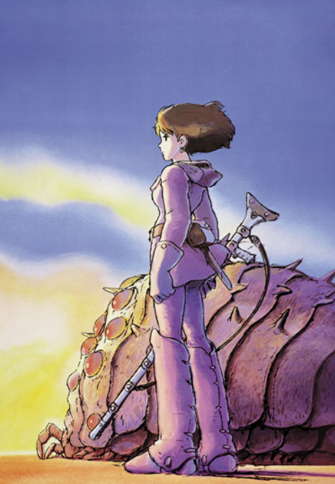
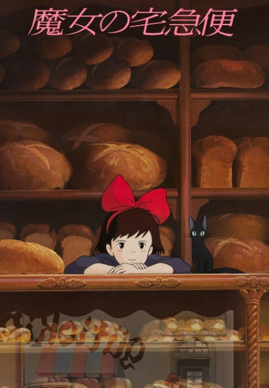
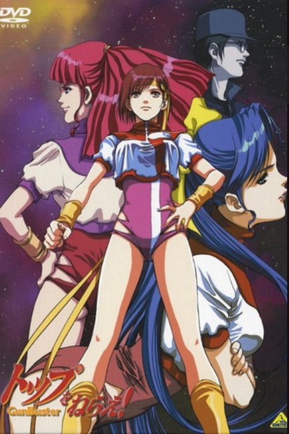
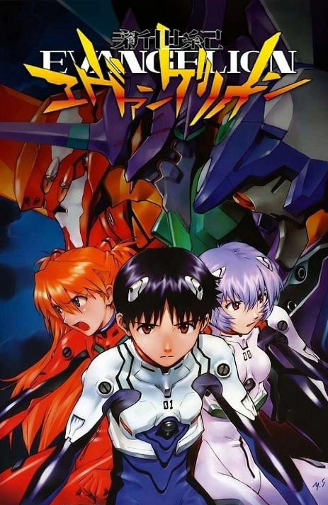
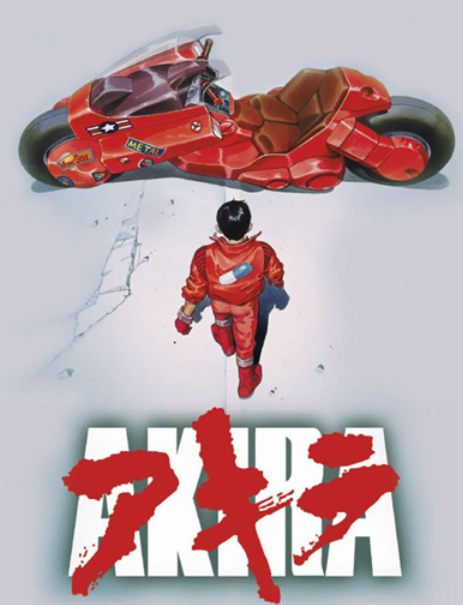
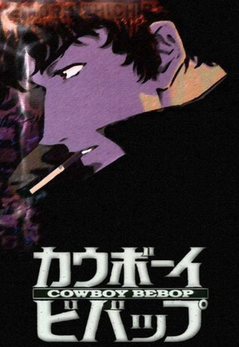
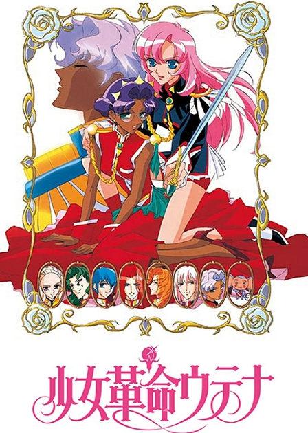

### 【参考】20世紀[の]{.size-xs}有名作品[（今通用するかは知らん）]{.size-xxs}
<!-- header: '§#num#. 常識作品（アニメ好きなら）' -->
{{{{{{{{{yoko
{{{{{{_
#### 1. 宮崎駿(ジブリ)

::::::yoko
:::_
{width=75}
:::
:::__
###### 未来少年コナン{.text-spacing .left .margin-v-zero}
:::
::::::

***
::::::yoko
:::_
{width=75}
:::
:::__
###### ルパン三世 カリオストロの城{.text-spacing .left .margin-v-zero}
:::
::::::

***
::::::yoko
:::_
{width=75}
:::
:::__
###### 風の谷のナウシカ{.text-spacing .left .margin-v-zero}
:::
::::::

***
::::::yoko
:::_
{width=75}
:::
:::__
###### 天空の城ラピュタ{.text-spacing .left .margin-v-zero}
:::
::::::

}}}}}}
{{{{{{_

::::::yoko
:::_
{width=75}
:::
:::__
###### 魔女の宅急便{.text-spacing .left .margin-v-zero}
:::
::::::

***
::::::yoko
:::_
{width=75}
:::
:::__
###### 紅の豚{.text-spacing .left .margin-v-zero}

:::
::::::

#### 2. GAINAX(庵野){.text-spacing .margin-top-zero}

::::::yoko
:::_
{width=75}
:::
:::__
###### トップをねらえ！{.text-spacing .left .margin-v-zero}
:::
::::::

***
::::::yoko
:::_
{width=75}
:::
:::__
###### ふしぎの海のナディア{.text-spacing .size-s .left}

:::
::::::

}}}}}}
{{{{{{_
::::::yoko
:::_
{width=75}
:::
:::__
###### エヴァンゲリオン{.text-spacing .left .margin-v-zero}
:::
::::::

#### 3. 他{.margin-top-zero}

::::::yoko
:::_
{width=75}
:::
:::__
###### アキラ{.text-spacing .left .margin-v-zero}
- 大友克洋
:::
::::::

***
::::::yoko
:::_
{width=75}
:::
:::__
###### カウボーイビバップ{.text-spacing .left .margin-v-zero}
- 渡辺信一郎
:::
::::::

***
::::::yoko
:::_
{width=75}
:::
:::__
###### 少女革命ウテナ{.text-spacing .left .margin-v-zero}
- 幾原邦彦
:::
::::::

}}}}}}
}}}}}}}}}yoko

